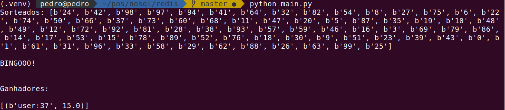

# Reginsgo

Bingo game using python and redis.

# Install requirements

> pip install -r requirements.txt

# Start Redis

Start redis using docker

> docker run -d -p 6379:6379 --name redis1 redis                                                                                                                                         

To use redis-cli, you need to enter the container shell

> docker exec -it redis1 sh   

once inside the container

> redis-cli 

# Run 

> python main.py